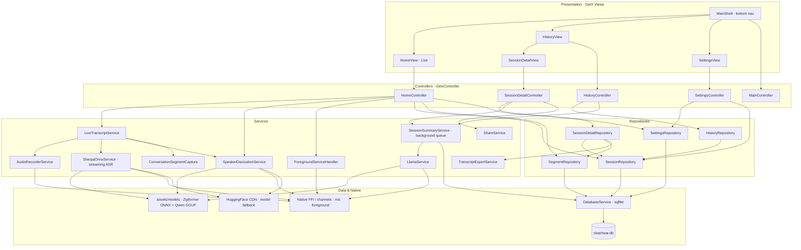
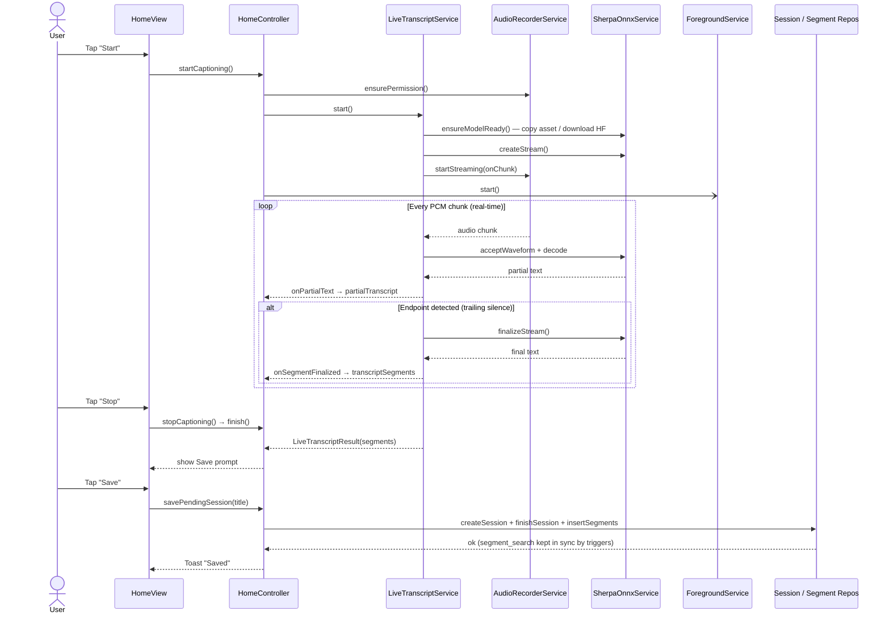
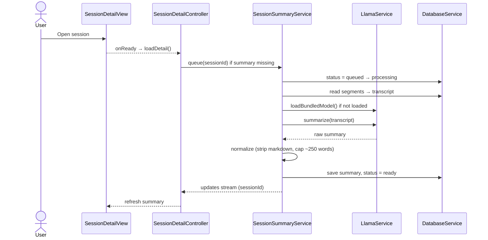
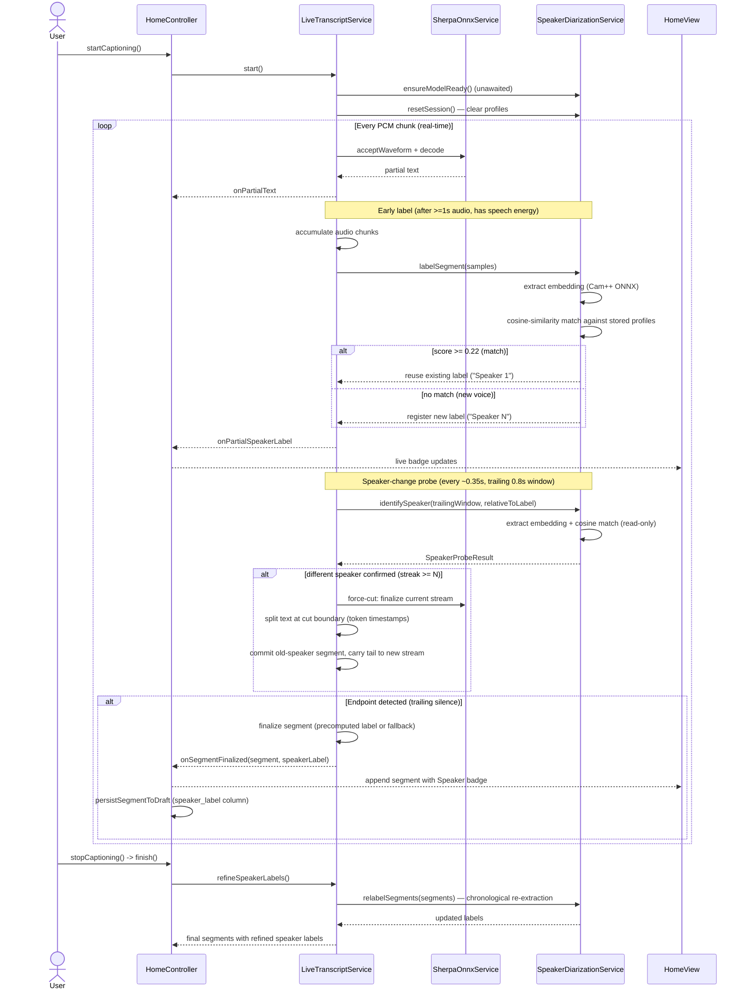
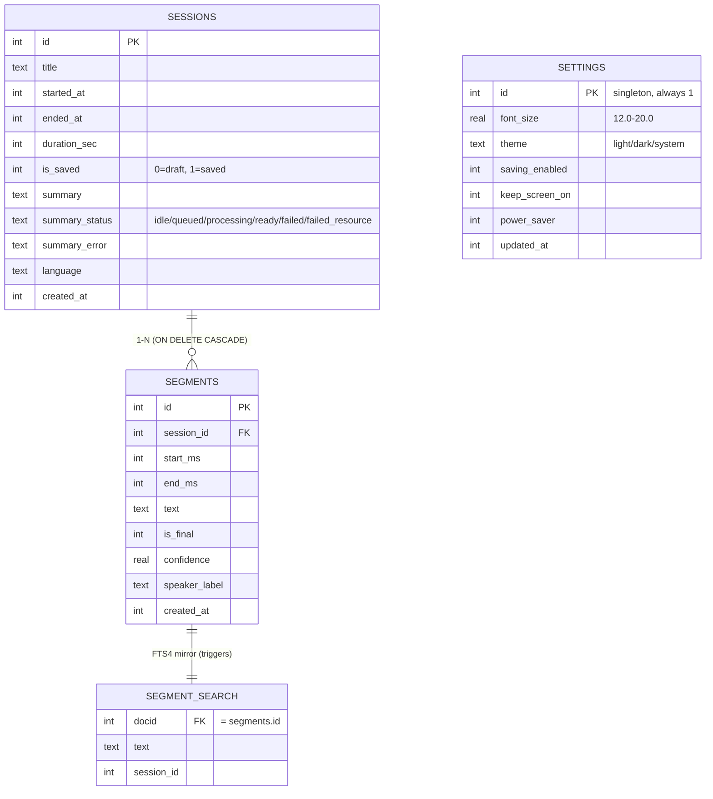

# ClearHear (Transcribe-Summarize-ClearHear)

On-device live captioning for Flutter. Streams microphone audio, transcribes it in real time with **sherpa-onnx** (streaming Zipformer2), and summarizes the transcript locally with **flutter_llama** (Qwen2.5-0.5B GGUF).

Transcription and summarization run entirely on-device. The only network access is a fallback that downloads the ASR model from HuggingFace when it is missing from `assets/`.

State management: **GetX**.

## Features

- **Offline live captions** — real-time on-device transcription (sherpa-onnx streaming Zipformer2); no network needed once the model is present.
- **Speaker diarization** — each transcript line is automatically tagged with who is speaking (Speaker 1, Speaker 2, ...). Voice embeddings are extracted on-device (sherpa-onnx Cam++), matched by cosine similarity, and labels appear live as colored badges while captioning. Speaker-change detection splits utterances mid-stream when the voice changes, and labels are re-refined after each session for accuracy. Everything runs offline — no voice data ever leaves the device.
- **Pause & resume** captioning within a session.
- **On-device summaries** — summarize a session with a local LLM (Qwen2.5-0.5B); retryable on failure.
- **Local history + search** — sessions stored in SQLite with full-text search and multi-select delete.
- **Session detail** — review the transcript and summary, and share/export the transcript.
- **Adjustable caption size** — enlarge/shrink live (A+/A−), with a persisted default.
- **Privacy controls** — toggle whether transcripts are saved, or clear all data.
- **Background capture** — an Android foreground service keeps captioning alive when the app is backgrounded.

## Architecture

ClearHear is layered: **View → Controller → Service / Repository → DatabaseService / Native**.

- **Presentation** — `MainShell` hosts a bottom-nav with one `View` per tab (Live, History, Settings). Session detail opens from History.
- **Controllers** (`GetxController`) — hold reactive state (`.obs`) and orchestrate services/repositories.
- **Services** — business logic and I/O: streaming ASR (`SherpaOnnxService`), mic capture (`AudioRecorderService`), real-time transcript orchestration (`LiveTranscriptService`), background summarization (`SessionSummaryService`), the LLM (`LlamaService`), the Android foreground service, and sharing/export.
- **Repositories** — data-access layer. Core tables (session, segment, settings) are an interface + `impl` over a single `DatabaseService`; `HistoryRepository` and `SessionDetailRepository` compose those repositories instead of touching the database.
- **Data & Native** — SQLite via `sqflite`, model files under `assets/models`, and native access through FFI (`sherpa_onnx`, `flutter_llama`) and a MethodChannel (foreground service).



`SessionSummaryService` is the only orchestration service that bypasses the repository layer and uses `DatabaseService` directly, because it runs as an independent background job chain.

### Live captioning flow

Start → real-time streaming ASR → Stop → optional Save.



### Summarization flow

Runs on-device via `flutter_llama`, off the UI thread, driven by `SessionSummaryService`.



## Speaker Diarization

ClearHear automatically figures out **who is speaking** and tags each transcript line with a speaker label — all on-device, no internet needed.

You don't tell the app who is talking. It analyzes each speaker's voice and assigns a consistent label throughout the session. The first person gets labeled **Speaker 1**, the second **Speaker 2**, and so on. When the same person speaks again later, they get the same label. Everything resets when you start a new session — "Speaker 1" in one session is unrelated to "Speaker 1" in another.

This works because each speaker's voice can be represented by a distinctive acoustic embedding (sometimes called a voice fingerprint). ClearHear extracts that fingerprint from each utterance using a small on-device neural network (Cam++), then compares new voices against previously seen ones. If the voice matches a known speaker, it reuses that label. If it's a new voice, it registers a new speaker.

### Example

Two people talking:

**Alice:** Good morning.  
**Bob:** Hi Alice.  
**Alice:** How are you?

ClearHear captions this as:

**Speaker 1:** Good morning.  
**Speaker 2:** Hi Alice.  
**Speaker 1:** How are you?

The app doesn't know their names are Alice and Bob — but it correctly identifies that two distinct voices are present and attributes each line to the right person.

The following sequence diagram shows how speaker labels are generated and updated during live captioning.

### Speaker Diarization flow

Each finalized ASR segment's audio is run through a **speaker embedding model** (sherpa-onnx Cam++, ONNX) to produce an embedding vector. This embedding is matched against previously seen speakers via **cosine similarity** (computed in Dart, not via sherpa-onnx's native manager). Labels (`Speaker 1`, `Speaker 2`, …) are assigned live and appear in the caption UI. The session resets the roster at every start.



Key design decisions:

- **Threshold 0.22** — tuned from real device logs of multi-speaker conversations with the bundled Cam++ embedding model (`3dspeaker_speech_campplus_sv_zh_en_16k-common_advanced.onnx`, 16 kHz). Higher thresholds (0.3–0.5) caused false negatives; genuine same-speaker scores stay ≥0.22 while impostor scores remain ≤0.13. These score distributions are current empirical observations and may drift with future model or preprocessing changes.
- **Multiple stored samples per speaker (up to 8)** — matching against the best individual sample is more robust than a single running-average centroid, because a real voice varies noticeably between short utterances.
- **Read-only probes for speaker change** — `identifySpeaker()` never registers new speakers or updates stored samples, making it safe to call repeatedly on rolling windows mid-utterance.
- **Confirmation gating** — a speaker-change probe must be confirmed 1–2 times (depending on confidence margin) before triggering a force-cut, preventing false switches from short cross-talk or noisy windows.
- **Session-independent rosters** — `resetSession()` clears all profiles at every `start()`, so "Speaker 1" in session A is unrelated to "Speaker 1" in session B.

## Data model

SQLite (`clearhear.db`) with WAL mode and `foreign_keys = ON`. Full-text search is backed by an FTS4 virtual table kept in sync with `segments` through triggers.



- **sessions** — one row per captioning session. `is_saved = 0` marks an in-progress/draft session; `summary_status` tracks the async summary job.
- **segments** — transcript lines, `ON DELETE CASCADE` from `sessions`.
- **settings** — a single-row table (`id = 1`) for app preferences.
- **segment_search** — FTS4 mirror of `segments.text`; do not write to it directly.

## Requirements

| Tool | Notes |
|------|-------|
| [FVM](https://fvm.app) | Project pins Flutter in `.fvmrc` (currently **3.44.4**) |
| Xcode + CocoaPods | iOS builds (macOS only) |
| Android SDK | NDK + CMake **3.22+** (Android SDK Manager) |
| [Git LFS](https://git-lfs.com) | The summary GGUF is stored via LFS |
| Internet | First run only — to fetch the ASR model (~72 MB) if it is not already in `assets/` |

Microphone permission is declared in `android/app/src/main/AndroidManifest.xml` and `ios/Runner/Info.plist`.

## First-time setup

From the project root:

```bash
fvm install && fvm use
fvm flutter pub get

# Summary model (Qwen GGUF) — tracked with Git LFS
git lfs install
git lfs pull

# ASR model (sherpa-onnx Zipformer, ~72 MB) — NOT in the repo, fetch into assets/
bash tool/download_sherpa_onnx_model.sh

# Android — required after every pub get (patches flutter_llama's llama.cpp headers)
bash tool/setup_flutter_llama_android.sh

# iOS — required after every pub get (patches flutter_llama's Swift bridge)
bash tool/patch_flutter_llama_ios.sh
cd ios && pod install && cd ..
```

Use `fvm flutter` (not a global Flutter SDK) so the version matches `.fvmrc`.

> The ASR model directory `assets/models/sherpa-onnx-streaming-zipformer-en-2023-06-26/` is git-ignored. If you skip the download script, the app downloads the model from HuggingFace on first launch instead.

## Run

```bash
fvm flutter run
```

Use a **full rebuild** after `pub get` or native plugin changes — not hot reload.

## Models

Defaults are in `lib/config/ml_model_config.dart`:

| Feature | Default |
|---------|---------|
| Transcription | sherpa-onnx streaming **Zipformer2**, English (int8 ONNX) |
| Speaker diarization | sherpa-onnx **Cam++** embedding extractor (3D-Speaker, ONNX); cosine-similarity matching in Dart |
| Summarization | **Qwen2.5-0.5B-Instruct** (GGUF via `flutter_llama`) |
| Segment boundary | endpoint detection on trailing silence (~0.8 s) |
| Audio | 16 kHz mono PCM |

**Model distribution**

- **ASR (ONNX)** — encoder / decoder / joiner + `tokens.txt`. Fetched by `tool/download_sherpa_onnx_model.sh` into `assets/models/...`; the app copies them to its data directory on first launch. If the assets are missing, `SherpaOnnxService` downloads them from HuggingFace as a fallback.
- **Speaker embedding (ONNX)** — `3dspeaker_speech_campplus_sv_zh_en_16k-common_advanced.onnx` (~27 MB). Fetched by the same download script; the app copies it alongside the ASR model with the same HuggingFace fallback.
- **Summary (GGUF)** — `assets/models/qwen2.5-0.5b-instruct-q4_k_m.gguf`, stored with **Git LFS**. After cloning:

```bash
git lfs install
git lfs pull
ls -lh assets/models/qwen2.5-0.5b-instruct-q4_k_m.gguf   # should be ~469 MB, not a small pointer
```

## Build

Bump the app version in `pubspec.yaml` (`version: x.y.z+build`) before release. The Settings screen reads that value.

**Android APK**

```bash
fvm flutter build apk --release
```

Output: `build/app/outputs/flutter-apk/app-release.apk`

Split per ABI (smaller downloads):

```bash
fvm flutter build apk --release --split-per-abi
```

**iOS IPA** (macOS + Xcode signing required)

```bash
fvm flutter build ipa --release --export-options-plist=ios/ExportOptions-adhoc.plist
```

Output: `build/ios/ipa/*.ipa`

## Captioning flow

1. **Start** — the mic streams PCM chunks straight into sherpa-onnx's streaming recognizer.
2. **Real-time** — partial text is emitted after each decode cycle; a segment is finalized when endpoint detection sees trailing silence. An Android foreground service keeps capture alive in the background.
3. **Stop** — `finish()` flushes any remaining audio and returns the segments; a Save prompt appears.
4. **Save** — the session and its segments are written to SQLite (FTS index synced by triggers).
5. **Summarize** — `SessionSummaryService` runs the on-device LLM off the UI thread and stores the summary.

Debug logs: `[LiveTranscript]`, `[SherpaOnnx]`, `[Transcribe]`, `[SegmentCapture]`, `[Summary]`, `[DB]`.

## Troubleshooting

| Issue | Fix |
|-------|-----|
| ASR model fails to load / `SherpaOnnx model is not ready` | Run `bash tool/download_sherpa_onnx_model.sh` (or let the app download on first launch). Confirm `assets/models/sherpa-onnx-.../` is not empty |
| Android: `flutter_llama` / CMake / `llama_context_type` errors | `bash tool/setup_flutter_llama_android.sh` after `pub get`, then full rebuild |
| Android: CMake 3.19+ / `SPIRV-Headers` (`ggml-vulkan`) errors | Same script (CPU backend). Install CMake 3.22+ via Android SDK Manager if prompted |
| iOS: app crashes on Summarize / `llama_init_model` SIGSEGV | `bash tool/patch_flutter_llama_ios.sh`, then `cd ios && pod install` and full rebuild |
| Summary model fails to load (`INIT_FAILED`) | The GGUF in `assets/models/` is tracked by Git LFS. Install [Git LFS](https://git-lfs.com), run `git lfs pull`, confirm the file is ~469 MB (not a small pointer), then full rebuild |
| `version solving failed` / `json_annotation` | Use `fvm flutter pub get` with the Flutter version from `.fvmrc` (currently **3.44.4**) |
| `MissingPluginException` / mic unavailable | Full rebuild (`fvm flutter run`), not hot reload |
| ASR model download fails | Check network; retry on Wi‑Fi |
| ANR / UI freeze during ML | Ensure heavy work stays off the UI thread; rebuild with latest code |

## Project layout

```text
lib/
  arch/
    repository/           # Interfaces + impl (session, segment, settings, history, detail)
    route/                # GetX routes (AppRoutes / AppPages)
  config/                 # ml_model_config.dart
  lang/                   # i18n keys + translations
  model/                  # Domain models (ConversationSegment, ...)
  screen/                 # main, home (live), history, session_details, settings, development
  service/                # Audio, SherpaOnnx (ASR), LiveTranscript, Llama,
                          #   SessionSummary, Database, ForegroundService, Share, ...
  shared/                 # Shared models / widgets / builders
  style/  util/           # Theme, helpers (toast, logger, datetime)
tool/
  download_sherpa_onnx_model.sh   # Fetch the ASR model (ONNX) into assets/
  setup_flutter_llama_android.sh  # Patch flutter_llama for Android (after pub get)
  patch_flutter_llama_ios.sh      # Patch flutter_llama for iOS (after pub get)
android/app/src/main/kotlin/com/nus/clearhear/
  TranscriptionForegroundService.kt   # Foreground service (MethodChannel: clearhear/foreground_service)
```
