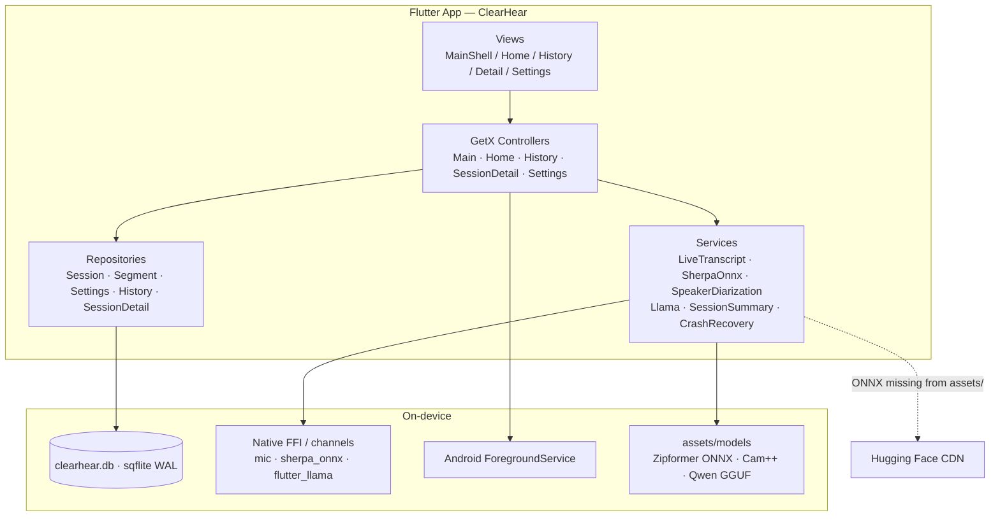
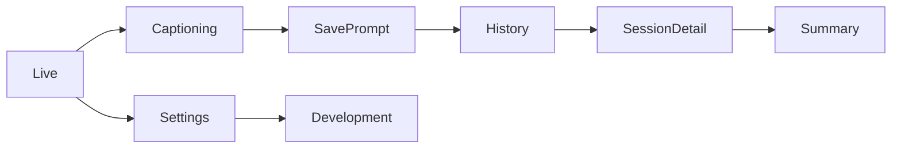
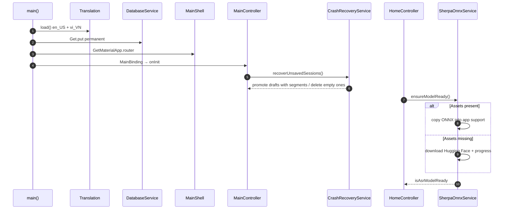
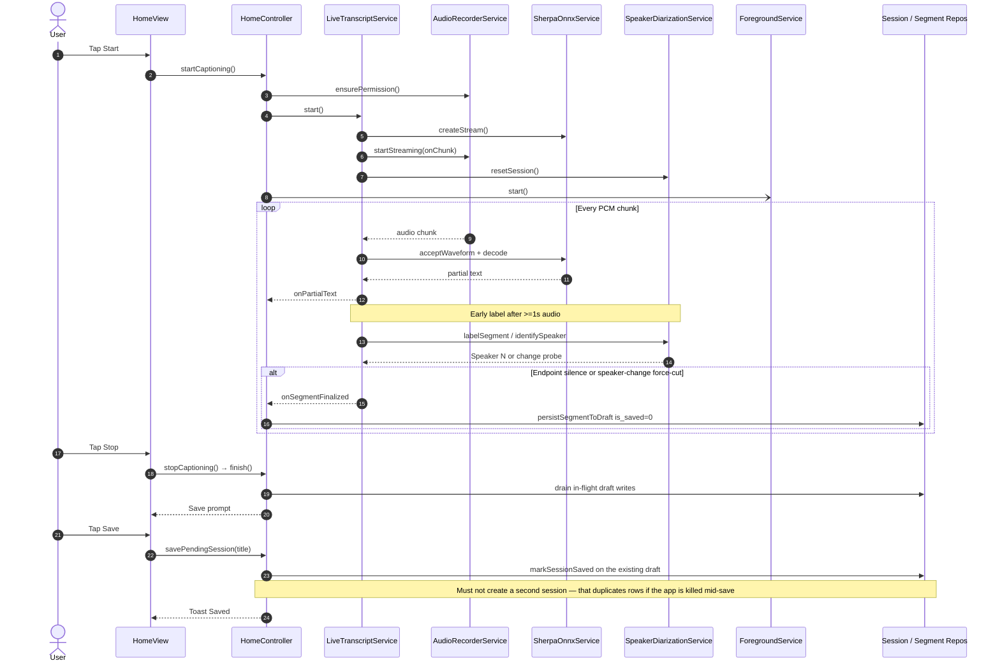
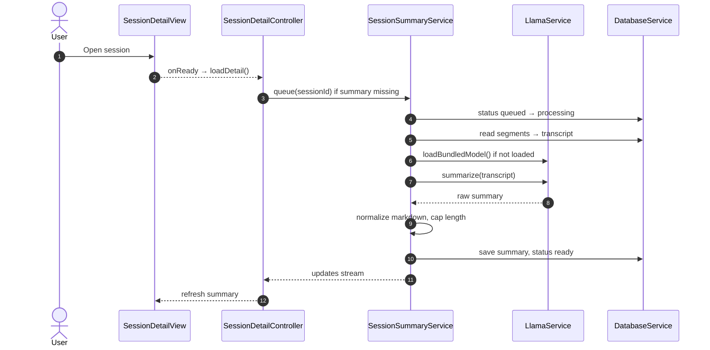
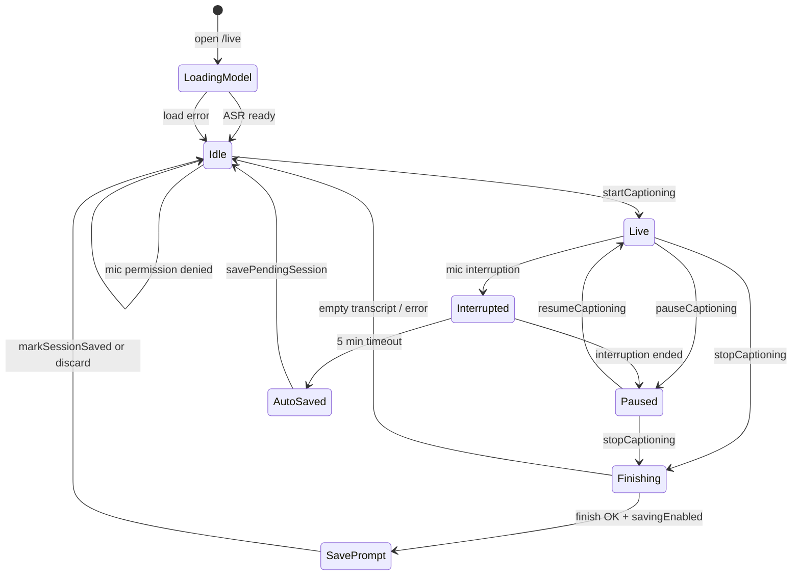
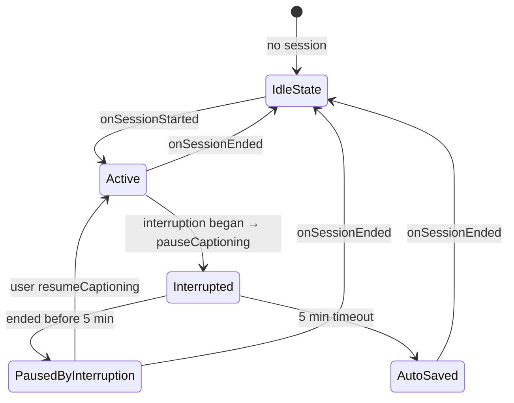
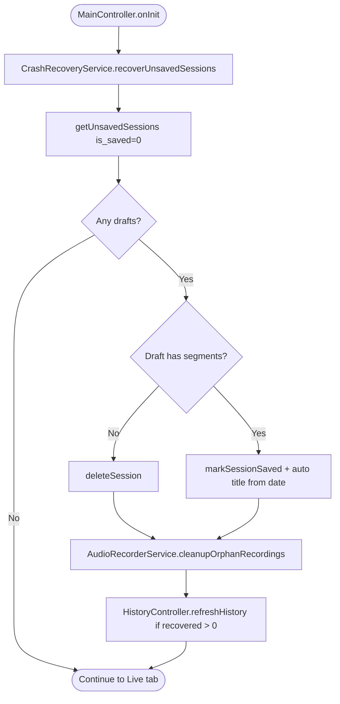
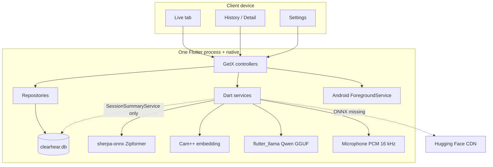
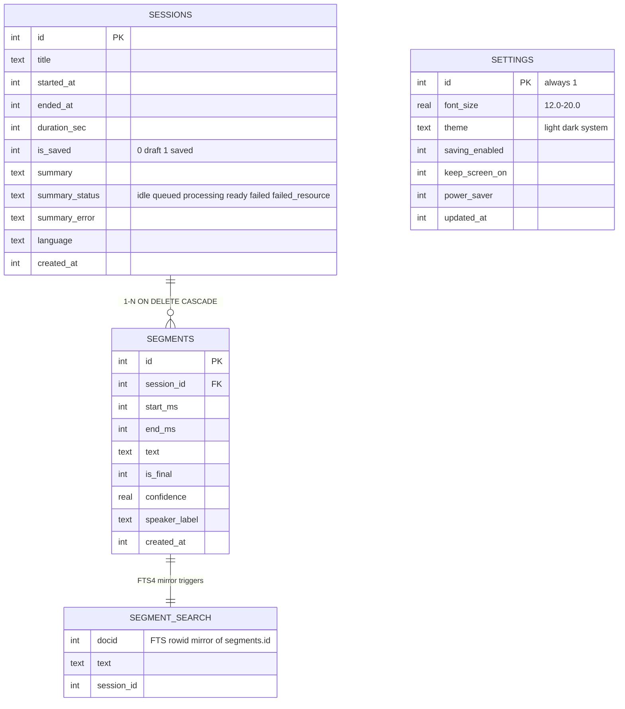

# ClearHear (Transcribe-Summarize-ClearHear)

[](LICENSE)
[](.fvmrc)

**ClearHear** is a demonstration project by [NUS Technology](https://www.nustechnology.com/) exploring on-device AI, real-time speech recognition, and offline live captioning.

This repository is the Flutter mobile client: it streams microphone audio, transcribes it in real time with **sherpa-onnx** (streaming Zipformer2), labels speakers live, and summarizes the transcript locally with **flutter_llama** (Qwen2.5-0.5B GGUF). Users can save sessions, search history, and export transcripts.

Transcription, diarization, and summarization run entirely **on-device**. There is no ClearHear backend. The only network access for ML is a fallback that downloads missing ONNX models from Hugging Face when they are not in `assets/`.

- **Company:** [NUS Technology](https://www.nustechnology.com/)
- **Labs:** [ClearHear — Real-Time Offline Live Captioning](https://www.nustechnology.com/labs/clearhear-live-captioning)

## Table of contents

- [Tech stack](#tech-stack)
- [Getting started](#getting-started)
- [Project structure](#project-structure)
- [Mobile architecture](#mobile-architecture)
- [Sequence diagrams](#sequence-diagrams)
- [Captioning lifecycle](#captioning-lifecycle)
- [Crash recovery / draft sessions](#crash-recovery--draft-sessions)
- [Deployment / runtime topology](#deployment--runtime-topology)
- [Conceptual data model](#conceptual-data-model)
- [Main routes](#main-routes)
- [Localization](#localization)
- [Conventions](#conventions)

---

## Tech stack

| Layer | Technology |
|---|---|
| UI | Flutter (Material) |
| Navigation | GetX (`GetMaterialApp.router`, nested `GetPage`) |
| State / DI | GetX (`GetxController`, `Obx`, `Get.put` / `Get.lazyPut`) |
| ASR | sherpa-onnx streaming Zipformer2 (ONNX) |
| Speakers | sherpa-onnx Cam++ embeddings; cosine similarity in Dart |
| Summarization | `flutter_llama` (Qwen2.5-0.5B GGUF) |
| Storage | sqflite (WAL, FTS4 `segment_search`) |
| i18n | GetX translations (`en_US` / `vi_VN`) |
| Background | Android foreground service (`clearhear/foreground_service`) |

---

## Getting started

### Prerequisites

- [FVM](https://fvm.app) so the SDK matches `.fvmrc` (currently **3.44.4**); Dart `>=3.3.3 <4.0.0` (see `pubspec.yaml`)
- iOS: Xcode + CocoaPods; Android: Android SDK, NDK, CMake **3.22+**
- [Git LFS](https://git-lfs.com) — the summary GGUF (~469 MB) is stored via LFS
- Microphone permission (live captioning)
- ~700 MB+ free storage for models, runtime copies, and download overhead (GGUF ~469 MB + ASR ~72 MB + embedding ~27 MB; ONNX files are also copied from `assets/` into app data)

### Run

```bash
fvm install && fvm use
fvm flutter pub get

# Summary model (Qwen GGUF) — tracked with Git LFS
git lfs install
git lfs pull

# ASR (~72 MB) + speaker-embedding (~27 MB) — git-ignored
bash tool/download_sherpa_onnx_model.sh

# Android — rerun after EVERY pub get
bash tool/setup_flutter_llama_android.sh

# iOS — rerun after EVERY pub get
bash tool/patch_flutter_llama_ios.sh
cd ios && pod install && cd ..

fvm flutter run
```

Use `fvm flutter` (not a global Flutter SDK) so the version matches `.fvmrc`.

The ASR directory `assets/models/sherpa-onnx-streaming-zipformer-en-2023-06-26/` is git-ignored. If you skip the download script, the app downloads the model from Hugging Face when it is not already present in `assets/`.

Use a **full rebuild** after `pub get` or native plugin changes — hot reload is not reliable for this project.

### Checks and codegen

```bash
fvm flutter analyze
fvm flutter test
fvm flutter test test/service/crash_recovery_service_test.dart
fvm flutter test --plain-name "recovers each crashed draft"
```

This project does not use `build_runner` / Freezed. CI (`.github/workflows/flutter-ci.yml`) runs `flutter pub get --enforce-lockfile`, `flutter analyze`, and `flutter test` on pull requests **and** pushes to `main` — so `pubspec.lock` must stay in sync, and tests must not depend on native ASR/LLM or downloaded models.

Release:

```bash
fvm flutter build apk --release            # add --split-per-abi for smaller downloads
fvm flutter build ipa --release --export-options-plist=ios/ExportOptions-adhoc.plist
```

Bump the app version in `pubspec.yaml` (`version: x.y.z+build`) before release. The Settings screen reads that value.

### Model configuration

Configured in `lib/config/ml_model_config.dart`.

| Feature | Default |
|---------|---------|
| Transcription | sherpa-onnx streaming **Zipformer2**, English (int8 ONNX, ~72 MB) |
| Speaker diarization | sherpa-onnx **Cam++** embedding extractor (3D-Speaker, ONNX, ~27 MB); cosine-similarity matching in Dart |
| Summarization | **Qwen2.5-0.5B-Instruct** (GGUF via `flutter_llama`, ~469 MB) |
| Segment boundary | endpoint detection on trailing silence (~0.8 s) |
| Audio | 16 kHz mono PCM |

**Model distribution**

- **ASR (ONNX)** — encoder / decoder / joiner + `tokens.txt`. Fetched by `tool/download_sherpa_onnx_model.sh` into `assets/models/...`; the app copies them to its data directory. If they are not already present in `assets/`, `SherpaOnnxService` downloads them from Hugging Face as a fallback.
- **Speaker embedding (ONNX)** — `3dspeaker_speech_campplus_sv_zh_en_16k-common_advanced.onnx`. Fetched by the same download script; same Hugging Face fallback.
- **Summary (GGUF)** — `assets/models/qwen2.5-0.5b-instruct-q4_k_m.gguf`, stored with **Git LFS**. A file that is only a few hundred bytes means Git LFS was not pulled.

```bash
git lfs install
git lfs pull
ls -lh assets/models/qwen2.5-0.5b-instruct-q4_k_m.gguf   # should be ~469 MB, not a small pointer
```

Upstream licenses and attribution: [NOTICE.md](NOTICE.md). Application source is under the [NUS Technology Non-Commercial License 1.0](LICENSE) (personal/educational use; no commercial use; no redistribution); model weights keep their own upstream terms.

---

## Project structure

```text
lib/
├── main.dart
├── arch/
│   ├── repository/       # Interfaces + impl (session, segment, settings, history, detail)
│   └── route/            # GetX routes (AppRoutes / AppPages)
├── config/               # ml_model_config.dart
├── lang/                 # i18n keys + Translation
├── model/                # ConversationSegment, TranscriptSegmentEntry
├── screen/               # main, home (live), history, session_details, settings, development
├── service/              # ASR, diarization, llama, summary, DB, crash recovery, ...
├── shared/               # Shared models / widgets / builders
├── style/                # AppColors / AppTheme
└── util/                 # toast, logger, datetime
tool/
  download_sherpa_onnx_model.sh
  setup_flutter_llama_android.sh
  patch_flutter_llama_ios.sh
android/app/src/main/kotlin/com/nus/clearhear/
  TranscriptionForegroundService.kt
```

Feature layout: **View → Controller → Service / Repository → DatabaseService / Native**

```text
screen/{feature}/
  bindings/  controllers/  widgets/  *_widget.dart | *_view.dart
```

---

## Mobile architecture

Code-layer view of the Flutter client. Runtime nodes (devices, models, Hugging Face) are in [Deployment / runtime topology](#deployment--runtime-topology).



| Layer | Responsibility |
|---|---|
| **Views** | Render UI; call controller methods; react with `Obx` |
| **Controllers** | Business logic, mic permissions, timers, session lifecycle |
| **Services** | Streaming ASR, embeddings, LLM, summary queue, crash recovery |
| **Repositories** | Typed SQLite access via `DatabaseService` (interface + impl) |
| **Native** | FFI sherpa-onnx / llama; MethodChannel foreground service |
| **Hugging Face** | Fallback ONNX download when assets are missing — not an app backend |

`SessionSummaryService` is the **one exception**: it bypasses repositories and queries `DatabaseService` directly, because it runs as an independent background job chain.

`HistoryRepository` and `SessionDetailRepository` **compose** those repositories and never touch the database directly (`SessionDetailRepository` also wraps `TranscriptExportService`).

### Feature map



---

## Sequence diagrams

### 1. Cold start and model load



### 2. Live captioning



Speaker notes:

- Cosine threshold **0.22** (`MlModelConfig.diarizationSpeakerMatchThreshold`) — tuned from real device logs with the bundled Cam++ 16 kHz model. Impostor scores typically stay ≤0.13.
- Up to **8 stored samples** per speaker; match against the best individual sample, not a running-average centroid.
- Speaker-change probes are **read-only** (`identifySpeaker`) — they never register new speakers mid-utterance.
- Session-independent rosters: `resetSession()` at every `start()`, so "Speaker 1" in session A is unrelated to "Speaker 1" in session B.
- The `.wav` file the recorder writes is an artifact only — it is deleted and never used for ASR.

### 3. On-device summary



Jobs run one at a time on a single `_jobChain`. Status values: `idle` / `queued` / `processing` / `ready` / `failed` / `failed_resource`.

---

## Captioning lifecycle

Session states driven by `HomeController` and `MicrophoneInterruptionManager`: start / pause / resume / stop, mic permission, and OS audio interruptions (phone calls, audio focus).

Interruption timeout is **5 minutes**. When it elapses, the in-progress draft is auto-saved.

### Captioning — `HomeController`



### Interruption — `MicrophoneInterruptionManager`



| Flag / signal | Owner | Meaning |
|---|---|---|
| `isAsrModelReady` / `isAsrModelLoading` | Home | Zipformer copied or downloaded |
| `isCaptioning` | Home | Session running (including while paused) |
| `isPaused` / `isPausing` | Home | User pause vs in-flight pause transition |
| `isInterrupted` | Home | OS cut the mic (call / audio focus) |
| `isFinishingTranscript` | Home | Stop started; blocks overlapping start/stop |
| `showSaveSessionPrompt` | Home | Save sheet after `finish()` |
| `is_saved = 0` | DB | Incremental draft while recording |

---

## Crash recovery / draft sessions

Triggered at startup from `MainController.onInit` → `CrashRecoveryService.recoverUnsavedSessions()`. Segments are persisted **incrementally while recording** into a draft session (`is_saved = 0`) via `_persistSegmentToDraft`.

Two paths then finalize that draft, and both must yield exactly **one** row:

- **Normal save** — `savePendingSession()` promotes the existing draft in place with `markSessionSaved(...)`. It must **not** create a second session and copy segments; doing so reintroduces a duplicate-session bug when the app is killed mid-save. `_saveAsNewSession` is only a fallback for when no draft exists.
- **Crash recovery** — promotes leftover drafts that have segments, deletes empty ones, and cleans orphan recordings.

History and search only show saved rows (`is_saved = 1`).



Notes:

- Recovery auto title uses `StringKeys.homeSaveSessionAutoTitle` with `YYYY-MM-DD`.
- If Settings has saving disabled (`saving_enabled = 0`), stop does not show the save prompt and the draft is discarded.
- A mic interruption longer than 5 minutes calls `savePendingSession` with the default title.

---

## Deployment / runtime topology

Focus: **which processes talk to which**. Control and media both stay **on-device**. There is no REST API and no LiveKit.



| Plane | Protocol | Examples |
|---|---|---|
| **Control** | Dart in-process | Controllers, repositories, GetX DI |
| **Media / ASR** | PCM → sherpa-onnx FFI | Partial text, endpoint, speaker embeddings |
| **Summarization** | GGUF via flutter_llama | `SessionSummaryService._jobChain` |
| **Persistence** | SQLite WAL | sessions, segments, settings, FTS4 |
| **Network (optional)** | HTTPS | ONNX download from Hugging Face when assets are missing |
| **Background** | MethodChannel | `clearhear/foreground_service` keeps the mic alive when Android is backgrounded |

Audio, captions, embeddings, and summaries **do not leave the device**, except the optional ONNX download. Users can disable saving and clear local data in Settings.

```bash
fvm flutter run
fvm flutter build apk --release
fvm flutter build ipa --release --export-options-plist=ios/ExportOptions-adhoc.plist
```

---

## Conceptual data model

SQLite (`clearhear.db`) with WAL mode and `foreign_keys = ON`. Schema lives in `lib/service/database_service.dart` (migrations in `_onUpgrade`). `segment_search` is an **FTS4 mirror of `segments.text` kept in sync by triggers**; never write to it directly.

### Confirmed from schema / models

- **SESSIONS** — `SessionModel` (`title`, timestamps, `is_saved`, `summary`, `summary_status`)
- **SEGMENTS** — `SegmentModel` (`start_ms` / `end_ms`, `text`, `speaker_label`)
- **SETTINGS** — `SettingsModel` singleton `id = 1`
- **SEGMENT_SEARCH** — FTS4; `docid = segments.id`



| Entity | Confidence | Notes |
|---|---|---|
| **SESSIONS** | Confirmed schema | History only shows `is_saved = 1` |
| **SEGMENTS** | Confirmed schema | Partial text is never written — memory only |
| **SETTINGS** | Confirmed schema | Single row, `id = 1` |
| **SEGMENT_SEARCH** | Confirmed schema | Trigger-maintained; do not `INSERT` by hand |

Runtime-only (not DB tables): PCM buffers, `ConversationSegment`, model-download progress.

---

## Main routes

Nested under `MainShell` (`GetRouterOutlet`). Initial route: `/live`.

| Path | Screen |
|---|---|
| `/` | MainShell (bottom nav) |
| `/live` | Live captioning (`HomeView`) |
| `/history` | Session history |
| `/history/detail/:id` | Session detail + summary |
| `/settings` | Settings |
| `/settings/development` | Development (from Settings) |

Declared in `lib/arch/route/app_route.dart`. Each screen has its own `bindings/` file. `MainBinding` registers the shared services/repositories plus a **permanent** `HomeController`.

---

## Localization

The app ships **two locales** (`en_US`, `vi_VN`). Every user-facing string goes through GetX translations — there are no hardcoded literals in widgets.

- Assets: `assets/i18n/en_us.json`, `assets/i18n/vi_vn.json`
- Keys: `lib/lang/string_keys.dart`
- Load: `lib/lang/translation.dart` (`Translation.load()` in `main()`)

```dart
Text(StringKeys.homeStartCaptioning.tr)
```

Skipping `vi_vn.json` does not fail the build — the Vietnamese UI just renders the raw key.

To add a string:

1. add the constant to `lib/lang/string_keys.dart`
2. add the same key to **both** `assets/i18n/en_us.json` and `assets/i18n/vi_vn.json`
3. use `StringKeys.someKey.tr`

---

## Conventions

- Keep source and user-facing copy in English keys + i18n JSON (no hardcoded UI strings).
- Toasts: `AppToast.success/error/warning/info` (`lib/util/toast/`). Never `Get.snackbar`.
- Logging: `AppLogger.info/warning/error` with a `tag:` (`lib/util/logger/`). Never `print`.
- Colors: prefer `AppColors` / `AppTheme` in `lib/style/theme.dart`.
- Shared widgets: check `lib/shared/widgets/` (`AppDialog`, `AppLoading`, `AppTitlebar`, `HighlightedText`, `InlineEditableTitle`) before writing a new one.
- Commit subjects follow `type(scope): summary` (e.g. `fix(home): ...`). PRs are squashed to a single commit.
- Tests use hand-written fakes implementing the repository interfaces (see `test/service/crash_recovery_service_test.dart`, `test/screen/home/home_controller_save_test.dart`); keep native ASR/LLM/mic out of tests by injecting fakes into `HomeController`.
- Draft sessions and crash recovery are easy to break — read `savePendingSession` and `CrashRecoveryService` before changing save paths.
