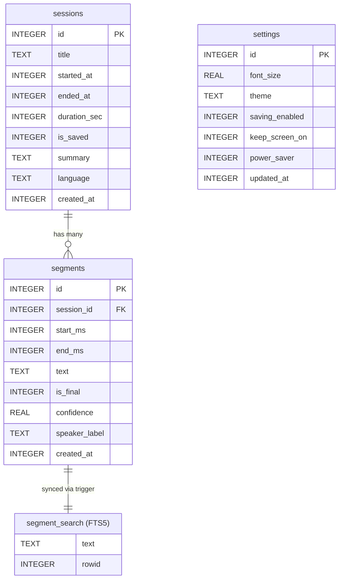

# ClearHear — Complete SQLite Data Layer Design

> **Target:** Flutter 3.32.5 · Dart ≥3.3.3 · GetX 4.6.6 · `sqflite` + `sqflite_fts5`  
> **Architecture:** Clean Architecture · SOLID · Feature-based folder layout per `AGENTS.md`

---

## 1. Database Design Explanation

ClearHear is a fully offline, on-device app. SQLite is the **sole persistent store**. The data layer must satisfy five non-negotiable constraints:

| Constraint | Rationale |
|---|---|
| **Real-time writes ≤ 1 ms UI impact** | Whisper emits final segments during live recording; blocking the main isolate causes frame drops |
| **Tens of thousands of segments per DB** | A 60-min session at 4-second chunks ≈ 900 segments; full history may hold hundreds of sessions |
| **FTS search across all sessions** | Users expect instant keyword search over the entire transcript history |
| **Schema must evolve safely** | Confidence, language, speaker diarization will be added iteratively |
| **Cascading deletes** | Deleting a session must clean up all dependent rows atomically |

### Design Decisions

- **Normalized 3-table schema** (`sessions`, `segments`, `settings`) — avoids duplication, supports clean joins.
- **INTEGER Unix timestamps** — smaller than ISO strings, index-friendly, sortable natively.
- **FTS5 virtual table + triggers** — full-text search without denormalizing `segments`.
- **WAL journal mode** — concurrent reads/writes without blocking; mandatory for real-time captioning.
- **Repository pattern** — controllers never touch SQL; they call typed repository methods.
- **sqflite `batch()`** — batch inserts for bulk segment persistence after a session ends.

---

## 2. ER Diagram



---

## 3. Complete SQLite Schema

```sql
-- ============================================================
-- PRAGMA: Enable foreign keys & WAL before any DDL
-- ============================================================
PRAGMA foreign_keys = ON;
PRAGMA journal_mode = WAL;
PRAGMA synchronous   = NORMAL;   -- safe with WAL; faster than FULL
PRAGMA cache_size    = -8000;    -- 8 MB page cache
PRAGMA temp_store    = MEMORY;

-- ============================================================
-- TABLE: sessions
-- ============================================================
CREATE TABLE IF NOT EXISTS sessions (
    id           INTEGER PRIMARY KEY AUTOINCREMENT,
    title        TEXT    NOT NULL DEFAULT 'Untitled',
    started_at   INTEGER NOT NULL,                      -- Unix epoch (seconds)
    ended_at     INTEGER,                               -- NULL while recording
    duration_sec INTEGER CHECK (duration_sec IS NULL OR duration_sec >= 0),
    is_saved     INTEGER NOT NULL DEFAULT 1             -- BOOLEAN: 0/1
                         CHECK (is_saved IN (0, 1)),
    summary      TEXT,                                  -- NULL until generated
    language     TEXT    NOT NULL DEFAULT 'auto',
    created_at   INTEGER NOT NULL
);

-- ============================================================
-- TABLE: segments
-- ============================================================
CREATE TABLE IF NOT EXISTS segments (
    id            INTEGER PRIMARY KEY AUTOINCREMENT,
    session_id    INTEGER NOT NULL
                          REFERENCES sessions(id) ON DELETE CASCADE,
    start_ms      INTEGER NOT NULL CHECK (start_ms >= 0),
    end_ms        INTEGER NOT NULL CHECK (end_ms >= start_ms),
    text          TEXT    NOT NULL,
    is_final      INTEGER NOT NULL DEFAULT 1            -- always 1 in DB (partials live in memory only)
                          CHECK (is_final IN (0, 1)),
    confidence    REAL             CHECK (confidence IS NULL OR (confidence >= 0.0 AND confidence <= 1.0)),
    speaker_label TEXT,                                 -- NULL until diarization added
    created_at    INTEGER NOT NULL
);

-- ============================================================
-- TABLE: settings  (singleton — always id = 1)
-- ============================================================
CREATE TABLE IF NOT EXISTS settings (
    id              INTEGER PRIMARY KEY CHECK (id = 1),  -- enforce singleton
    font_size       REAL    NOT NULL DEFAULT 20.0
                            CHECK (font_size >= 12.0 AND font_size <= 48.0),
    theme           TEXT    NOT NULL DEFAULT 'system'
                            CHECK (theme IN ('light', 'dark', 'system')),
    saving_enabled  INTEGER NOT NULL DEFAULT 1
                            CHECK (saving_enabled IN (0, 1)),
    keep_screen_on  INTEGER NOT NULL DEFAULT 0
                            CHECK (keep_screen_on IN (0, 1)),
    power_saver     INTEGER NOT NULL DEFAULT 0
                            CHECK (power_saver IN (0, 1)),
    updated_at      INTEGER NOT NULL
);

-- Seed the singleton row on first open (INSERT OR IGNORE)
INSERT OR IGNORE INTO settings (id, font_size, theme, saving_enabled, keep_screen_on, power_saver, updated_at)
VALUES (1, 20.0, 'system', 1, 0, 0, strftime('%s','now'));
```

---

## 4. Indexes

```sql
-- ============================================================
-- INDEXES
-- ============================================================

-- History screen: list sessions ordered by most-recent start
CREATE INDEX IF NOT EXISTS idx_sessions_started_at
    ON sessions (started_at DESC);

-- Quickly filter saved-only sessions
CREATE INDEX IF NOT EXISTS idx_sessions_is_saved
    ON sessions (is_saved, started_at DESC);

-- Transcript viewer: load all segments for a session ordered by time
CREATE INDEX IF NOT EXISTS idx_segments_session_start
    ON segments (session_id, start_ms ASC);

-- Full session deletion check (covered by FK, but explicit index speeds DELETE CASCADE)
CREATE INDEX IF NOT EXISTS idx_segments_session_id
    ON segments (session_id);

-- Speaker view (future diarization grouping)
CREATE INDEX IF NOT EXISTS idx_segments_speaker
    ON segments (session_id, speaker_label, start_ms ASC)
    WHERE speaker_label IS NOT NULL;
```

**Why these indexes:**

| Index | Screen / Query | Without Index |
|---|---|---|
| `idx_sessions_started_at` | History list | Full table scan on every page load |
| `idx_sessions_is_saved` | Filtered history | Can't skip unsaved rows cheaply |
| `idx_segments_session_start` | Transcript viewer | Unordered segment fetch, sort in Dart |
| `idx_segments_session_id` | DELETE CASCADE | Linear scan on every row deletion |
| `idx_segments_speaker` | Future speaker grouping | Cross-product group-by on millions of rows |

---

## 5. Triggers

```sql
-- ============================================================
-- FTS5 SYNC TRIGGERS
-- ============================================================

-- INSERT: add segment text to FTS index
CREATE TRIGGER IF NOT EXISTS trg_segments_ai
    AFTER INSERT ON segments
BEGIN
    INSERT INTO segment_search (rowid, text, session_id)
    VALUES (NEW.id, NEW.text, NEW.session_id);
END;

-- DELETE: remove segment from FTS index
CREATE TRIGGER IF NOT EXISTS trg_segments_ad
    AFTER DELETE ON segments
BEGIN
    DELETE FROM segment_search WHERE rowid = OLD.id;
END;

-- UPDATE (text changed): rebuild FTS row
CREATE TRIGGER IF NOT EXISTS trg_segments_au
    AFTER UPDATE OF text ON segments
BEGIN
    DELETE FROM segment_search WHERE rowid = OLD.id;
    INSERT INTO segment_search (rowid, text, session_id)
    VALUES (NEW.id, NEW.text, NEW.session_id);
END;
```

---

## 6. FTS5 Schema

```sql
-- ============================================================
-- FTS5: full-text search over transcript segments
-- ============================================================
CREATE VIRTUAL TABLE IF NOT EXISTS segment_search
USING fts5 (
    text,                        -- searchable transcript text
    session_id UNINDEXED,        -- stored but not tokenized (for join)
    content     = segments,      -- external content table
    content_rowid = id,          -- map FTS rowid → segments.id
    tokenize    = 'unicode61 remove_diacritics 2'  -- accent-insensitive
);

-- ============================================================
-- FTS5 SEARCH QUERIES (examples)
-- ============================================================

-- Basic keyword search — returns segment rows with snippet highlight
SELECT
    s.id            AS session_id,
    s.title,
    s.started_at,
    sg.id           AS segment_id,
    sg.start_ms,
    snippet(segment_search, 0, '<b>', '</b>', '…', 20) AS highlighted_text,
    rank
FROM segment_search
JOIN segments  sg ON sg.id        = segment_search.rowid
JOIN sessions  s  ON s.id         = segment_search.session_id
WHERE segment_search MATCH :query
ORDER BY rank;                   -- FTS5 BM25 relevance, ascending = most relevant

-- Phrase search
WHERE segment_search MATCH '"machine learning"'

-- Prefix search (autocomplete)
WHERE segment_search MATCH 'transcri*'

-- Session-scoped search
WHERE segment_search MATCH :query
  AND segment_search.session_id = :sessionId
```

**FTS5 Configuration Choices:**

| Option | Value | Reason |
|---|---|---|
| `tokenize` | `unicode61 remove_diacritics 2` | Handles accented chars, multilingual text |
| `content` | `segments` | External content table keeps data single-source |
| `content_rowid` | `id` | Direct mapping, no extra join column needed |
| `session_id UNINDEXED` | stored, not tokenized | Required for `WHERE session_id = ?` without FTS bloat |

---

## 7. Migration Scripts

```sql
-- ============================================================
-- Migration v1 — Initial Schema (DB version = 1)
-- ============================================================
-- Run inside sqflite onCreate callback
-- (All DDL from sections 3, 4, 5, 6 above)

-- ============================================================
-- Migration v2 — Add confidence column (DB version = 2)
-- ============================================================
ALTER TABLE segments ADD COLUMN confidence REAL
    CHECK (confidence IS NULL OR (confidence >= 0.0 AND confidence <= 1.0));

-- Rebuild FTS (external content table auto-updates via triggers; no FTS DDL change needed)

-- ============================================================
-- Migration v3 — Add language column (DB version = 3)
-- ============================================================
ALTER TABLE sessions ADD COLUMN language TEXT NOT NULL DEFAULT 'auto';
```

### Migration Execution Strategy

```dart
// lib/service/database_service.dart  (pseudocode)

Future<void> _onUpgrade(Database db, int oldVersion, int newVersion) async {
  // Run migrations sequentially — never skip a version
  for (int v = oldVersion + 1; v <= newVersion; v++) {
    await _runMigration(db, v);
  }
}

Future<void> _runMigration(Database db, int version) async {
  final batch = db.batch();
  switch (version) {
    case 2:
      batch.execute('''
        ALTER TABLE segments ADD COLUMN confidence REAL
        CHECK (confidence IS NULL OR (confidence >= 0.0 AND confidence <= 1.0))
      ''');
    case 3:
      batch.execute(
        "ALTER TABLE sessions ADD COLUMN language TEXT NOT NULL DEFAULT 'auto'",
      );
  }
  await batch.commit(noResult: true);
}
```

**Safety rules:**
1. Never mutate a released migration — add a new version instead.
2. Always test `onUpgrade` from every previous version, not just N-1.
3. Wrap multi-statement migrations in a transaction (`db.transaction`).
4. `ALTER TABLE` in SQLite supports only ADD COLUMN — dropping or renaming columns requires a table-copy migration.

**Table-copy migration pattern (when needed):**

```sql
-- For renames / column drops: create-copy-drop-rename
CREATE TABLE segments_new (…new schema…);
INSERT INTO segments_new SELECT …mapped columns… FROM segments;
DROP TABLE segments;
ALTER TABLE segments_new RENAME TO segments;
-- Recreate indexes and triggers
```

---

## 8. Repository Interfaces (Dart Abstract Classes)

```dart
// lib/arch/repository/session_repository.dart

abstract class SessionRepository {
  /// Creates a new session row and returns its id.
  Future<int> createSession({
    required String title,
    required int startedAt,
    String language = 'auto',
  });

  /// Marks the session as ended, stores final duration.
  Future<void> finishSession({
    required int id,
    required int endedAt,
    required int durationSec,
  });

  /// Returns null if not found.
  Future<SessionModel?> getSession(int id);

  /// Paginated history list, ordered by started_at DESC.
  Future<SessionPageResult> getAllSessions({
    required int offset,
    required int limit,
    bool savedOnly = false,
  });

  /// Deletes session and cascades to all segments + FTS rows.
  Future<void> deleteSession(int id);

  /// Bulk delete; returns count actually deleted.
  Future<int> deleteSessions(List<int> ids);

  /// Writes the AI-generated summary for a session.
  Future<void> updateSummary({required int id, required String summary});

  /// Updates the session title.
  Future<void> updateTitle({required int id, required String title});

  /// FTS search across session titles and segment text.
  Future<List<SearchResult>> searchSessions(String query, {int limit = 50});
}
```

```dart
// lib/arch/repository/segment_repository.dart

abstract class SegmentRepository {
  /// Inserts a single finalized segment.
  Future<int> insertSegment(SegmentModel segment);

  /// Batch inserts multiple segments in one transaction.
  /// Preferred for post-session bulk persistence.
  Future<void> insertSegments(List<SegmentModel> segments);

  /// Loads all finalized segments for a session, ordered by start_ms.
  Future<List<SegmentModel>> getSegments(int sessionId);

  /// Paginated segment loading for long sessions.
  Future<List<SegmentModel>> getSegmentsPaged({
    required int sessionId,
    required int offset,
    required int limit,
  });

  /// Deletes all segments for a session (usually called via CASCADE, exposed for explicit use).
  Future<void> deleteSegments(int sessionId);
}
```

```dart
// lib/arch/repository/settings_repository.dart

abstract class SettingsRepository {
  /// Returns the single settings row; creates it if missing.
  Future<SettingsModel> loadSettings();

  /// Full settings upsert.
  Future<void> saveSettings(SettingsModel settings);

  /// Targeted update for theme only.
  Future<void> updateTheme(String theme);

  /// Targeted update for font size only.
  Future<void> updateFontSize(double fontSize);

  /// Targeted update for saving_enabled flag.
  Future<void> updateSavingEnabled({required bool enabled});
}
```

---

## 9. Repository Implementation (Dart Pseudocode)

```dart
// lib/arch/repository/impl/session_repository_impl.dart

class SessionRepositoryImpl implements SessionRepository {
  SessionRepositoryImpl(this._db);
  final DatabaseService _db;

  @override
  Future<int> createSession({
    required String title,
    required int startedAt,
    String language = 'auto',
  }) async {
    final db = await _db.database;
    return db.insert(
      'sessions',
      {
        'title': title,
        'started_at': startedAt,
        'language': language,
        'is_saved': 1,
        'created_at': startedAt,
      },
      conflictAlgorithm: ConflictAlgorithm.replace,
    );
  }

  @override
  Future<void> finishSession({
    required int id,
    required int endedAt,
    required int durationSec,
  }) async {
    final db = await _db.database;
    await db.update(
      'sessions',
      {'ended_at': endedAt, 'duration_sec': durationSec},
      where: 'id = ?',
      whereArgs: [id],
    );
  }

  @override
  Future<SessionModel?> getSession(int id) async {
    final db = await _db.database;
    final rows = await db.query(
      'sessions',
      where: 'id = ?',
      whereArgs: [id],
      limit: 1,
    );
    return rows.isEmpty ? null : SessionModel.fromMap(rows.first);
  }

  @override
  Future<SessionPageResult> getAllSessions({
    required int offset,
    required int limit,
    bool savedOnly = false,
  }) async {
    final db = await _db.database;
    final where = savedOnly ? 'is_saved = 1' : null;
    final rows = await db.query(
      'sessions',
      where: where,
      orderBy: 'started_at DESC',
      limit: limit,
      offset: offset,
    );
    final items = rows.map(SessionModel.fromMap).toList();
    return SessionPageResult(
      items: items,
      hasMore: items.length == limit,
    );
  }

  @override
  Future<void> deleteSession(int id) async {
    final db = await _db.database;
    await db.delete('sessions', where: 'id = ?', whereArgs: [id]);
    // CASCADE removes segments; triggers remove FTS rows
  }

  @override
  Future<int> deleteSessions(List<int> ids) async {
    if (ids.isEmpty) return 0;
    final db = await _db.database;
    final placeholders = ids.map((_) => '?').join(',');
    return db.rawDelete(
      'DELETE FROM sessions WHERE id IN ($placeholders)',
      ids,
    );
  }

  @override
  Future<void> updateSummary({required int id, required String summary}) async {
    final db = await _db.database;
    await db.update(
      'sessions',
      {'summary': summary},
      where: 'id = ?',
      whereArgs: [id],
    );
  }

  @override
  Future<void> updateTitle({required int id, required String title}) async {
    final db = await _db.database;
    await db.update(
      'sessions',
      {'title': title},
      where: 'id = ?',
      whereArgs: [id],
    );
  }

  @override
  Future<List<SearchResult>> searchSessions(
    String query, {
    int limit = 50,
  }) async {
    final db = await _db.database;
    final sanitized = _sanitizeFtsQuery(query);
    final rows = await db.rawQuery('''
      SELECT
        s.id            AS session_id,
        s.title,
        s.started_at,
        sg.id           AS segment_id,
        sg.start_ms,
        snippet(segment_search, 0, '<b>', '</b>', '…', 20) AS highlighted_text,
        rank
      FROM segment_search
      JOIN segments  sg ON sg.id      = segment_search.rowid
      JOIN sessions  s  ON s.id       = sg.session_id
      WHERE segment_search MATCH ?
      ORDER BY rank
      LIMIT ?
    ''', [sanitized, limit]);
    return rows.map(SearchResult.fromMap).toList();
  }

  // Escape FTS5 special characters to prevent injection
  String _sanitizeFtsQuery(String input) {
    // Wrap each token in quotes for exact-token matching
    return input.trim().split(RegExp(r'\s+')).map((t) => '"$t"').join(' ');
  }
}
```

```dart
// lib/arch/repository/impl/segment_repository_impl.dart

class SegmentRepositoryImpl implements SegmentRepository {
  SegmentRepositoryImpl(this._db);
  final DatabaseService _db;

  @override
  Future<int> insertSegment(SegmentModel segment) async {
    final db = await _db.database;
    return db.insert('segments', segment.toMap());
    // trg_segments_ai fires automatically → FTS updated
  }

  @override
  Future<void> insertSegments(List<SegmentModel> segments) async {
    if (segments.isEmpty) return;
    final db = await _db.database;
    final batch = db.batch();
    for (final seg in segments) {
      batch.insert('segments', seg.toMap());
    }
    await batch.commit(noResult: true);
    // Each INSERT fires trg_segments_ai → FTS updated for all rows
  }

  @override
  Future<List<SegmentModel>> getSegments(int sessionId) async {
    final db = await _db.database;
    final rows = await db.query(
      'segments',
      where: 'session_id = ? AND is_final = 1',
      whereArgs: [sessionId],
      orderBy: 'start_ms ASC',
    );
    return rows.map(SegmentModel.fromMap).toList();
  }

  @override
  Future<List<SegmentModel>> getSegmentsPaged({
    required int sessionId,
    required int offset,
    required int limit,
  }) async {
    final db = await _db.database;
    final rows = await db.query(
      'segments',
      where: 'session_id = ? AND is_final = 1',
      whereArgs: [sessionId],
      orderBy: 'start_ms ASC',
      limit: limit,
      offset: offset,
    );
    return rows.map(SegmentModel.fromMap).toList();
  }

  @override
  Future<void> deleteSegments(int sessionId) async {
    final db = await _db.database;
    await db.delete(
      'segments',
      where: 'session_id = ?',
      whereArgs: [sessionId],
    );
  }
}
```

---

## 10. DAO Examples

```dart
// lib/service/database_service.dart
// (Service layer — wraps sqflite, exposes Database; no business logic)

class DatabaseService {
  static const _dbName    = 'clearhear.db';
  static const _dbVersion = 3;

  Database? _db;

  Future<Database> get database async {
    _db ??= await _open();
    return _db!;
  }

  Future<Database> _open() async {
    final dir  = await getApplicationDocumentsDirectory();
    final path = p.join(dir.path, _dbName);

    return openDatabase(
      path,
      version: _dbVersion,
      onCreate:  _onCreate,
      onUpgrade: _onUpgrade,
      onOpen:    _onOpen,
    );
  }

  Future<void> _onOpen(Database db) async {
    await db.execute('PRAGMA foreign_keys = ON');
    await db.execute('PRAGMA journal_mode = WAL');
    await db.execute('PRAGMA synchronous = NORMAL');
    await db.execute('PRAGMA cache_size = -8000');
    await db.execute('PRAGMA temp_store = MEMORY');
  }

  Future<void> _onCreate(Database db, int version) async {
    final batch = db.batch();
    // Execute all DDL from section 3, 4, 5, 6 in order
    _applyV1Schema(batch);
    await batch.commit(noResult: true);
  }

  Future<void> _onUpgrade(Database db, int oldVersion, int newVersion) async {
    for (int v = oldVersion + 1; v <= newVersion; v++) {
      await db.transaction((txn) async {
        await _runMigration(txn, v);
      });
    }
  }

  void dispose() {
    _db?.close();
    _db = null;
  }
}
```

---

## 11. CRUD Examples

```dart
// ── CREATE ────────────────────────────────────────────────────────────────────

// Start a new recording session
final sessionId = await sessionRepository.createSession(
  title: 'Team standup',
  startedAt: DateTime.now().millisecondsSinceEpoch ~/ 1000,
  language: 'en',
);

// Insert a finalized segment after Whisper returns
final segmentId = await segmentRepository.insertSegment(
  SegmentModel(
    sessionId: sessionId,
    startMs: 0,
    endMs: 4200,
    text: 'Hello, welcome to today's standup.',
    isFinal: true,
    confidence: 0.94,
    createdAt: DateTime.now().millisecondsSinceEpoch ~/ 1000,
  ),
);

// ── READ ─────────────────────────────────────────────────────────────────────

// Load paginated history
final page = await sessionRepository.getAllSessions(offset: 0, limit: 20);

// Load full transcript
final segments = await segmentRepository.getSegments(sessionId);
final transcript = segments.map((s) => s.text).join(' ');

// ── UPDATE ───────────────────────────────────────────────────────────────────

// Finish session after recording stops
await sessionRepository.finishSession(
  id: sessionId,
  endedAt: DateTime.now().millisecondsSinceEpoch ~/ 1000,
  durationSec: 3847,
);

// Store AI summary
await sessionRepository.updateSummary(
  id: sessionId,
  summary: 'The team discussed sprint goals and blockers…',
);

// ── DELETE ───────────────────────────────────────────────────────────────────

// Single delete (cascade removes segments + FTS rows)
await sessionRepository.deleteSession(sessionId);

// Bulk delete from history multi-select
await sessionRepository.deleteSessions([3, 7, 12]);

// ── SEARCH ───────────────────────────────────────────────────────────────────

final results = await sessionRepository.searchSessions('machine learning');
// results[0].highlightedText → 'I studied <b>machine learning</b> last night…'
```

---

## 12. Example Records

### sessions

| id | title | started_at | ended_at | duration_sec | is_saved | summary | language | created_at |
|---|---|---|---|---|---|---|---|---|
| 1 | Team standup | 1751500800 | 1751504647 | 3847 | 1 | "Team discussed sprint velocity…" | en | 1751500800 |
| 2 | Dr. Okafor appointment | 1751414400 | 1751416200 | 1800 | 1 | NULL | auto | 1751414400 |
| 3 | Lecture — Linguistics 201 | 1751328000 | 1751331600 | 3600 | 0 | NULL | en | 1751328000 |

### segments

| id | session_id | start_ms | end_ms | text | is_final | confidence | speaker_label | created_at |
|---|---|---|---|---|---|---|---|---|
| 1 | 1 | 0 | 4200 | Hello, welcome to today's standup. | 1 | 0.94 | NULL | 1751500800 |
| 2 | 1 | 4200 | 8900 | Let's start with Alice's update. | 1 | 0.91 | NULL | 1751500804 |
| 3 | 1 | 8900 | 13500 | We shipped the payment module yesterday. | 1 | 0.97 | NULL | 1751500808 |

### settings

| id | font_size | theme | saving_enabled | keep_screen_on | power_saver | updated_at |
|---|---|---|---|---|---|---|
| 1 | 20.0 | system | 1 | 0 | 0 | 1751500800 |

---

## 13. Performance Optimizations

### WAL Mode

```
PRAGMA journal_mode = WAL;
```

- Readers never block writers; writers never block readers.
- Critical during live captioning: the UI reads `transcript.obs` while a background isolate inserts a new segment.
- Without WAL, a write locks the entire DB → dropped frames.

### Transactions & Batch Insert

```dart
// End-of-session bulk persist (900 segments for 60-min session)
final batch = db.batch();
for (final seg in segments) {
  batch.insert('segments', seg.toMap());
}
await batch.commit(noResult: true);  // ~5 ms for 900 rows vs ~900 ms unbatched
```

- A single `COMMIT` amortizes the fsync cost across all rows.
- `noResult: true` skips row-id collection → ~20% faster.

### Prepared Statements

sqflite internally caches prepared statements per SQL string. Always use parameterized queries (never string interpolation):

```dart
// ✅ GOOD — cached prepared statement
db.query('segments', where: 'session_id = ?', whereArgs: [id]);

// ❌ BAD — new statement compiled every call
db.rawQuery('SELECT * FROM segments WHERE session_id = $id');
```

### Lazy Loading & Pagination

```dart
// History controller: load 20 at a time
final page = await sessionRepository.getAllSessions(offset: 0, limit: 20);

// Transcript viewer: load 100 segments at a time (handles 60-min sessions)
final segs = await segmentRepository.getSegmentsPaged(
  sessionId: id,
  offset: 0,
  limit: 100,
);
```

### Background Isolate for DB Writes

Run all segment inserts on a background isolate to guarantee zero-frame-drop:

```dart
// In HomeController — delegate to repository which uses compute()
await compute(_insertSegmentsBg, _PersistPayload(db: _db, segments: finalized));
```

### synchronous = NORMAL with WAL

```
PRAGMA synchronous = NORMAL;
```

- With WAL, `NORMAL` is crash-safe (WAL file survives power loss).
- `FULL` mode doubles write time with no real benefit in WAL mode.

### Cache Size

```
PRAGMA cache_size = -8000;  -- 8 MB
```

- Keeps hot pages (session index, recent segments) in memory.
- Eliminates repeat reads during continuous transcript rendering.

### Summary of Performance Targets

| Operation | Target | Strategy |
|---|---|---|
| Single segment insert (live) | < 1 ms | WAL + prepared stmt |
| Batch 900 segments (session end) | < 10 ms | sqflite batch + transaction |
| Load 20 sessions (history) | < 5 ms | Covered index scan |
| Load 100 segments (transcript) | < 3 ms | Composite index on (session_id, start_ms) |
| FTS keyword search | < 20 ms | FTS5 BM25 index |

---

## 14. Live Caption Architecture

```
Microphone input
       │
       ▼
AudioRecorderService.rotateChunk()
       │  (every N seconds, produces a WAV file)
       ▼
LiveTranscriptService._drainQueue()
       │  (background queue — never blocks UI)
       ▼
WhisperService.transcribeChunk()
       │  (on-device ASR → returns final text string)
       ▼
HomeController: transcript.value += chunk  ◄── UI UPDATE (in-memory only)
       │
       │  (partials never touch SQLite)
       ▼
session ends → HomeController.stopCaptioning()
       │
       ▼
SegmentRepository.insertSegments(allFinalizedChunks)
       │  (one batch transaction)
       ▼
SQLite: segments table + FTS5 updated via triggers
```

**Why this minimizes disk writes:**

| Approach | Disk writes per 60 min session |
|---|---|
| Insert on every partial update | Thousands (every ASR word) |
| Insert on every final chunk | ~900 (one per 4-sec chunk) |
| **Batch insert at session end** | **1 transaction, 900 rows** |

The current `LiveTranscriptService` accumulates chunks in `_segments: List<String>`. The SQLite integration maps each string to a `SegmentModel` and batch-inserts at `finish()`. Partials are **never persisted** — they exist only in `transcript.obs`.

> [!IMPORTANT]
> If the app is force-killed mid-session, in-memory segments are lost. To guard against this, consider a periodic checkpoint (every 30 segments) that batch-inserts without clearing the list — use an `_persistedUpTo` pointer to avoid double inserts.

---

## 15. Future Extensibility

### Speaker Diarization

`speaker_label TEXT` is already present on `segments`. Enable it by:
1. Populating it from a diarization model (e.g., pyannote-on-device port).
2. Adding `idx_segments_speaker` (already defined in §4).
3. Adding `GROUP BY speaker_label` queries to `SegmentRepository`.

No schema migration needed.

### Multilingual Support

`language TEXT` is already on `sessions`. To extend:
1. Detect per-segment language (Whisper reports this).
2. Add `language TEXT` to `segments` (migration v4).
3. Add multilingual FTS tokenizer (`icu` tokenizer) for CJK support.

### Cloud Sync

The current schema is sync-ready with minimal changes:

| Field to add | Table | Purpose |
|---|---|---|
| `remote_id TEXT` | sessions | Server-assigned UUID |
| `sync_status INTEGER` | sessions | 0=local, 1=pending, 2=synced |
| `updated_at INTEGER` | sessions, segments | Conflict resolution timestamp |

Pattern: local-first write → background sync queue → CRDT or last-write-wins conflict resolution.

### Export Formats

Add an `ExportService` that reads from repositories and formats:
- Plain text (`segments.text` joined)
- SRT subtitles (using `start_ms`/`end_ms`)
- JSON (full session + segments export)

No schema changes needed.

### Audio Attachment

```sql
-- Migration vN
ALTER TABLE sessions ADD COLUMN audio_path TEXT;  -- local file path to recording
ALTER TABLE sessions ADD COLUMN audio_size_bytes INTEGER;
```

---

## Appendix A: Folder Placement

Following `AGENTS.md` conventions:

```
lib/
├── service/
│   └── database_service.dart          ← sqflite open/migrate/PRAGMA
├── arch/
│   └── repository/
│       ├── session_repository.dart    ← abstract interface
│       ├── segment_repository.dart    ← abstract interface
│       ├── settings_repository.dart   ← abstract interface
│       └── impl/
│           ├── session_repository_impl.dart
│           ├── segment_repository_impl.dart
│           └── settings_repository_impl.dart
└── shared/
    └── models/
        ├── session_model.dart
        ├── segment_model.dart
        ├── settings_model.dart
        ├── session_page_result.dart
        └── search_result.dart
```

**Bindings registration order (per AGENTS.md rule):**

```dart
class AppBinding extends Bindings {
  @override
  void dependencies() {
    // 1. Service (lowest layer)
    Get.put<DatabaseService>(DatabaseService(), permanent: true);

    // 2. Repositories
    Get.lazyPut<SessionRepository>(
      () => SessionRepositoryImpl(Get.find<DatabaseService>()),
    );
    Get.lazyPut<SegmentRepository>(
      () => SegmentRepositoryImpl(Get.find<DatabaseService>()),
    );
    Get.lazyPut<SettingsRepository>(
      () => SettingsRepositoryImpl(Get.find<DatabaseService>()),
    );

    // 3. Controllers declared per-route in their own Bindings
  }
}
```

---

## Appendix B: Required pubspec.yaml Additions

```yaml
dependencies:
  sqflite: ^2.3.3
  sqflite_common_ffi: ^2.3.3      # desktop testing
  path: ^1.9.0                    # already transitive via path_provider
  path_provider: ^2.1.5           # already present
```

> [!NOTE]
> `sqflite` includes built-in FTS5 support on Android and iOS. No additional native plugin is needed. Desktop requires `sqflite_common_ffi`.
